# sdcpppal examples

Logos and banners — generated with sdcpppal wearing its own hat.

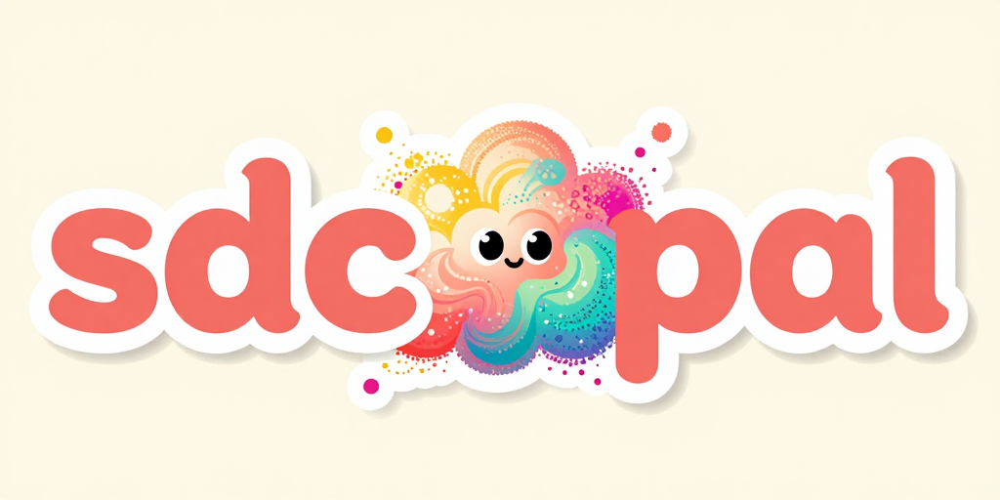

Each entry below lists the exact `generate_image(...)` call used, so any of these can be reproduced by pasting the call into an MCP client pointed at a matching `sd-server`.

## Model setup

All images in this directory were generated against a local `sd-server` with [Z-Image Turbo](https://huggingface.co/Tongyi-MAI/Z-Image-Turbo) (Q8_0) loaded:

```bash
sd-server \
  --diffusion-model /tank/ml/models/z-image/z_image_turbo-Q8_0.gguf \
  --vae /tank/ml/models/z-image/ae.safetensors \
  --llm /tank/ml/models/z-image/Qwen3-4B-Instruct-2507-Q5_K_M.gguf \
  --listen-ip 127.0.0.1 --listen-port 1234 \
  --diffusion-fa --cfg-scale 1.0 -v
```

Z-Image Turbo is a fast distilled model — 8–12 steps and `cfg=1` are typical. It's great at flat-vector sticker styles and decent at typography, with one caveat (see [wordmark notes](#wordmark-notes)).

## Logos (512×512)

### 01 — Crystallizing pal

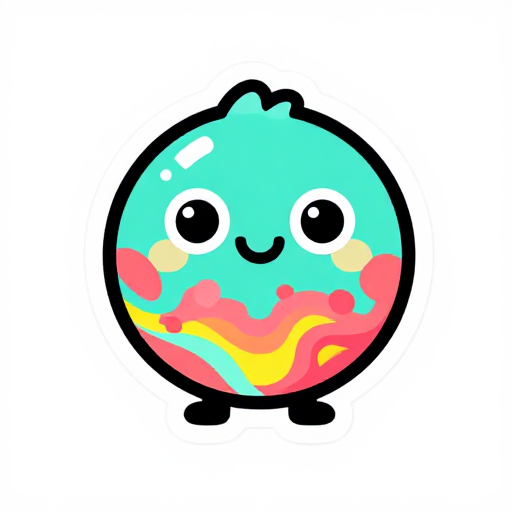

A round creature whose lower half is still diffusion noise — the tool's process made literal.

```python
generate_image(
    prompt=(
        "A cute mascot logo: a friendly round creature with big eyes "
        "and a smiling face, its lower half still composed of colorful "
        "swirling diffusion noise and pixel particles, transitioning "
        "into solid painted form at the top, flat vector illustration, "
        "thick bold black outlines, vibrant palette of teal, coral pink, "
        "and sunshine yellow, sticker style, centered on clean white "
        "background, logo design"
    ),
    negative_prompt="photorealistic, 3d render, blurry, text, watermark, signature, messy, cluttered background",
    width=512, height=512, steps=8,
    output_dir="./examples",
    filename_prefix="01_crystallizing_pal",
)
```

### 02 — Palette pal

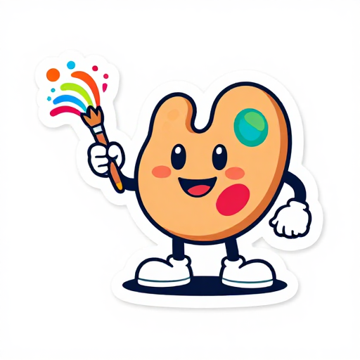

Classic mascot direction: a smiling paint palette holding a brush.

```python
generate_image(
    prompt=(
        "Mascot logo of a smiling paint palette character with a "
        "friendly cartoon face, holding a paintbrush that trails a "
        "rainbow of swirling color dots and particles, flat vector "
        "illustration, rounded shapes, thick bold outlines, bright "
        "saturated colors, sticker style badge design, centered on "
        "white background"
    ),
    negative_prompt="photorealistic, 3d render, blurry, text, watermark, signature, scary, cluttered",
    width=512, height=512, steps=8,
    output_dir="./examples",
    filename_prefix="02_palette_pal",
)
```

### 03 — Wordmark (stacked)

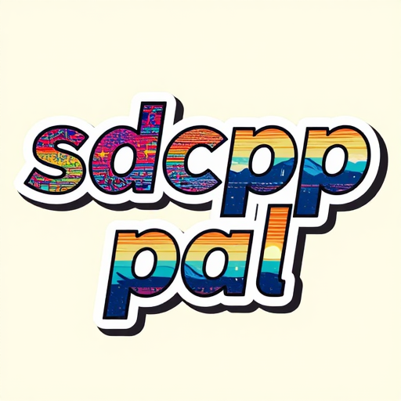

Two-line layout splits the triple-p naturally: `sdcpp` / `pal`. Gradient-in-letters effect with TV noise on the left resolving into landscape on the right.

```python
generate_image(
    prompt=(
        "Bold retro sticker logo with two stacked lines of text: the top "
        "line reads 'sdcpp' and the bottom line reads 'pal', thick "
        "rounded sans-serif lettering, the letters filled with a gradient "
        "transitioning from colorful TV static noise on the left side to "
        "a tiny serene landscape with mountains and setting sun on the "
        "right side, chunky white outline around the whole wordmark, "
        "flat vector design, 1990s zine aesthetic, centered on solid "
        "cream background, clean sharp edges, perfectly legible typography"
    ),
    negative_prompt="photorealistic, 3d render, blurry, cluttered, misspelled, missing letters, extra letters, handwriting, cursive, single line, three lines",
    width=512, height=512, steps=12, seed=99999,
    output_dir="./examples",
    filename_prefix="03_wordmark_stacked",
)
```

### 04 — Terminal cat


Cat peeking out of a CRT — callback to the README's cat-on-windowsill example and a wink at the CLI/MCP lineage.

```python
generate_image(
    prompt=(
        "Flat vector logo of a cute cartoon cat peeking out of a retro "
        "CRT terminal window, the terminal screen glowing with scattered "
        "colorful pixel noise and tiny flower sprites drifting upward "
        "around the cat, the cat has a curious expression and perked "
        "ears, bold geometric shapes, limited palette of teal, coral, "
        "mustard yellow, and cream, thick black outlines, centered on "
        "white background, sticker logo design"
    ),
    negative_prompt="photorealistic, 3d render, blurry, text, watermark, scary, cluttered, extra cats",
    width=512, height=512, steps=8,
    output_dir="./examples",
    filename_prefix="04_terminal_cat",
)
```

### 05 — Kitsune pal


Winking fox with a noise-particle tail flourish.

```python
generate_image(
    prompt=(
        "Flat vector mascot logo: a cute stylized fox character seated "
        "and smiling, with three flowing tails where the tip of each "
        "tail dissolves into colorful swirling diffusion noise and pixel "
        "particles that slowly resolve into solid fur toward the fox's "
        "body, thick bold black outlines, rounded shapes, vibrant "
        "palette of warm orange, teal, coral pink, and mustard yellow, "
        "sticker style, centered on clean cream background, logo design, no text"
    ),
    negative_prompt="photorealistic, 3d render, blurry, text, letters, watermark, signature, cluttered background, creepy",
    width=512, height=512, steps=12,
    output_dir="./examples",
    filename_prefix="05_kitsune_pal",
)
```

### 06 — Dissolving p's (square)

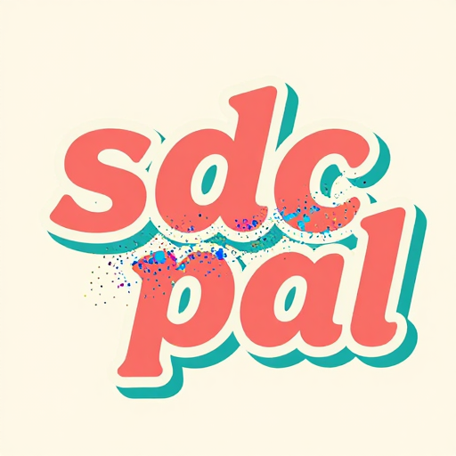

Square seed for the banner direction: `sdc` stacked over `pal`, with a diffusion-noise burst between them standing in for the unspellable middle.

```python
generate_image(
    prompt=(
        "Bold retro sticker wordmark logo: on a single line, the text "
        "starts solid as 'sdc' on the left, then the letters dissolve "
        "into a cloud of colorful swirling diffusion noise and scattered "
        "pixel particles in the middle, then resolve back into solid "
        "letters 'pal' on the right — as if the word is being generated "
        "by the diffusion process itself. Thick rounded sans-serif "
        "lettering in coral pink and teal, chunky white outline, flat "
        "vector design, 1990s zine sticker aesthetic, centered on cream "
        "background, playful and clever"
    ),
    negative_prompt="photorealistic, 3d render, blurry, cluttered, handwriting, cursive, multiple lines, stacked, three lines",
    width=512, height=512, steps=12,
    output_dir="./examples",
    filename_prefix="06_dissolving_ps",
)
```

## Banners (1024×512)

### banner_01 — Dissolving (hero)

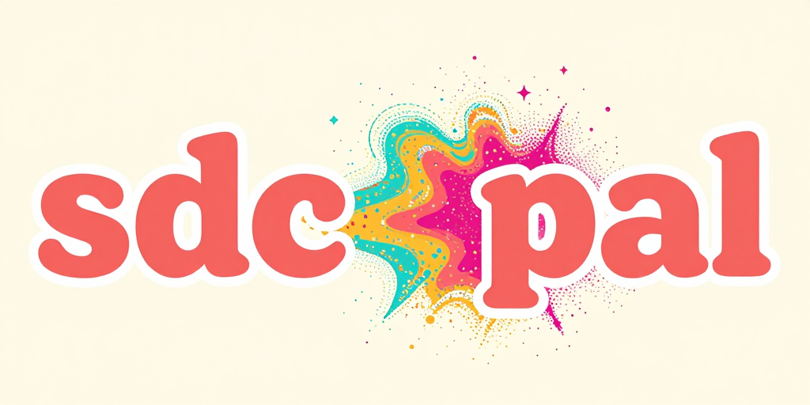

The winning concept given room to breathe: `sdc`, diffusion-cloud middle, `pal`.

```python
generate_image(
    prompt=(
        "Wide horizontal banner logo in a 1990s zine sticker style. On "
        "the left side, bold thick rounded coral pink sans-serif letters "
        "spell 'sdc' with chunky white outline. In the center, the "
        "letters explode and dissolve into a sprawling cloud of colorful "
        "swirling diffusion noise, scattered pixel particles, and tiny "
        "stars in coral, teal, mustard, and magenta. On the right side, "
        "the particles reform into bold thick rounded coral pink letters "
        "spelling 'pal' with matching white outline. Flat vector design, "
        "cream background, cinematic wide composition, playful"
    ),
    negative_prompt="photorealistic, 3d render, blurry, cluttered, handwriting, cursive, multiple lines, stacked text, square format, vertical, portrait",
    width=1024, height=512, steps=12,
    output_dir="./examples",
    filename_prefix="banner_01_dissolving",
)
```

### banner_02 — Synthwave

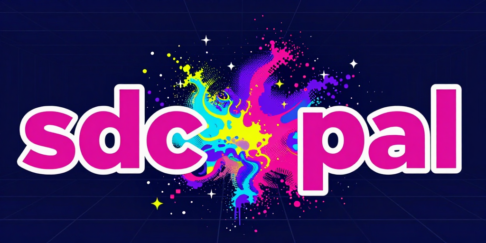

Same structure, neon-on-navy palette shift.

```python
generate_image(
    prompt=(
        "Wide horizontal banner logo in a retro synthwave sticker style. "
        "On the left, bold thick rounded hot-pink sans-serif letters "
        "spell 'sdc' with chunky white outline. In the center, the "
        "letters explode and dissolve into a sprawling cloud of swirling "
        "diffusion noise and scattered pixel particles in vivid "
        "synthwave colors: hot magenta, electric cyan, deep purple, and "
        "neon yellow, tiny stars twinkling throughout. On the right, the "
        "particles reform into bold thick rounded hot-pink letters "
        "spelling 'pal' with matching white outline. Flat vector design, "
        "deep navy background with subtle grid lines, cinematic wide "
        "composition, 1980s retro futurism"
    ),
    negative_prompt="photorealistic, 3d render, blurry, cluttered, handwriting, cursive, multiple lines, stacked text, square format, vertical, portrait",
    width=1024, height=512, steps=12,
    output_dir="./examples",
    filename_prefix="banner_02_synthwave",
)
```

### banner_03 — Creature peek (social card)


The charm shot. Same palette as banner_01, but a smiling round creature emerges from the noise cloud — the pal being generated in real time. Used as the README banner / social card.

```python
generate_image(
    prompt=(
        "Wide horizontal banner logo, sticker style. On the left, bold "
        "thick rounded coral pink sans-serif letters spell 'sdc' with "
        "chunky white outline. In the center, the letters dissolve into "
        "a cloud of colorful swirling diffusion noise and pixel "
        "particles in coral, teal, mustard, and magenta — and peeking "
        "out from the middle of the cloud is a tiny cute round creature "
        "with big eyes and a smiling face, as if it is being generated "
        "from the diffusion itself. On the right, the particles reform "
        "into bold thick rounded coral pink letters spelling 'pal' with "
        "matching white outline. Flat vector design, cream background, "
        "cinematic wide composition, playful and clever"
    ),
    negative_prompt="photorealistic, 3d render, blurry, cluttered, handwriting, cursive, multiple lines, stacked text, square format, vertical, portrait, scary",
    width=1024, height=512, steps=12,
    output_dir="./examples",
    filename_prefix="banner_03_creature_peek",
)
```

### banner_04 — Pixel glitch

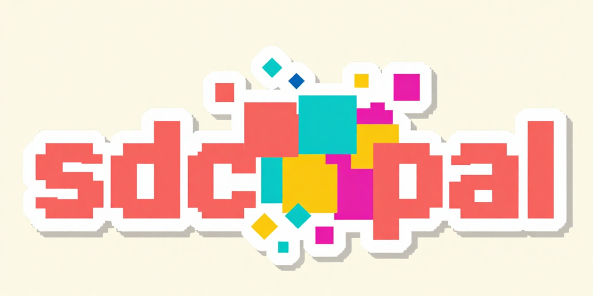

Chunky 8-bit dissolve — retro-game teleport aesthetic instead of smooth particles.

```python
generate_image(
    prompt=(
        "Wide horizontal banner logo in a retro 1990s 8-bit pixel art "
        "sticker style. On the left, bold chunky pixelated coral pink "
        "letters spell 'sdc' with crisp stepped edges. In the center, "
        "the letters shatter and dissolve into a sprawling cloud of "
        "large square pixels and 8-bit pixel particles in coral, teal, "
        "mustard yellow, and magenta, arranged like a glitchy teleport "
        "effect. On the right, the pixels reassemble into bold chunky "
        "pixelated coral pink letters spelling 'pal'. Thick white "
        "outline around the entire wordmark. Flat vector with visible "
        "pixel grid, cream background, cinematic wide composition, "
        "playful retro game aesthetic"
    ),
    negative_prompt="photorealistic, 3d render, blurry, smooth, cluttered, handwriting, cursive, multiple lines, stacked text, square format, vertical, portrait",
    width=1024, height=512, steps=12,
    output_dir="./examples",
    filename_prefix="banner_04_pixel_glitch",
)
```

## LoRA demo: wiring vs. activation

Three gens on a single prompt-and-seed axis showing how sdcpppal's `lora[]` field behaves. All three use `seed=42`, `steps=8`; gens 2 and 3 attach [`Haruka041/z-image-anime-lora`](https://huggingface.co/Haruka041/z-image-anime-lora) at multiplier `0.8`.

| 1. Baseline (no LoRA) | 2. LoRA attached, bland prompt | 3. LoRA attached, style cues |
|---|---|---|
| 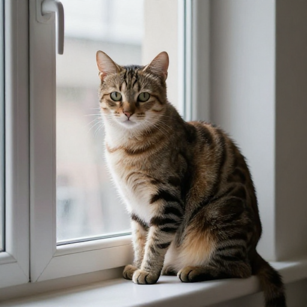 | 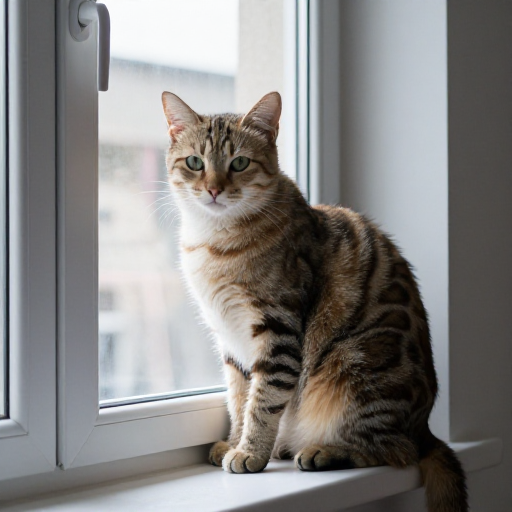 | 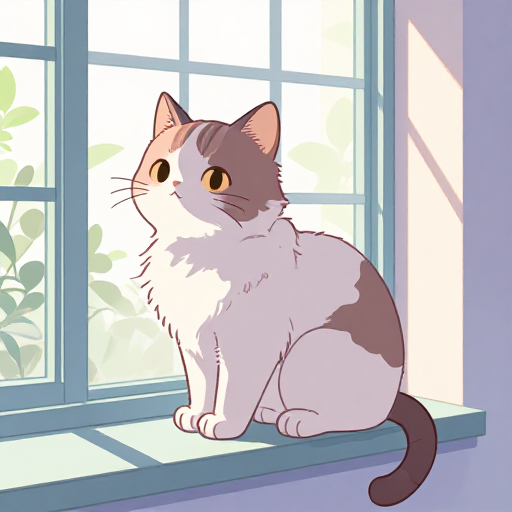 |

The interesting one is **gen 2**. It looks nearly identical to the baseline photo — but sd-server's logs show `(480 / 480) LoRA tensors have been applied, lora_file_path = .../sk_anime_style_v1.0.safetensors`. The weights *are* loaded. The sampler just has no reason to follow them: "a cat on a windowsill" is a prompt the base model handles fine, so the LoRA's pull gets averaged out toward the photorealistic answer.

**Gen 3** adds `masterpiece, best quality, anime style, 2d illustration, cel shading` — style cues the LoRA was trained to respond to — and the cat flips to pastel cel-shaded anime.

Takeaway: if a LoRA seems to do nothing, read its model card for a trigger phrase or style keywords before assuming the LoRA is broken. The fact that sdcpppal successfully forwarded the `lora[]` array doesn't guarantee a visible stylistic change — that requires prompt engineering too.

### Reproduce

```python
# 1 — baseline, no LoRA
generate_image(
    prompt="a cat on a windowsill",
    width=512, height=512, steps=8, seed=42,
    output_dir="./examples",
    filename_prefix="lora_01_baseline",
)

# 2 — LoRA attached, no style cue (proves wiring; activation fails)
generate_image(
    prompt="a cat on a windowsill",
    width=512, height=512, steps=8, seed=42,
    lora=[{
        "path": "z-image-anime-lora/sk_anime_style_v1.0.safetensors",
        "multiplier": 0.8,
    }],
    output_dir="./examples",
    filename_prefix="lora_02_no_cue",
)

# 3 — LoRA attached, with style cues
generate_image(
    prompt=(
        "masterpiece, best quality, anime style, a cat on a windowsill, "
        "2d illustration, soft pastel colors, cel shading"
    ),
    width=512, height=512, steps=8, seed=42,
    lora=[{
        "path": "z-image-anime-lora/sk_anime_style_v1.0.safetensors",
        "multiplier": 0.8,
    }],
    output_dir="./examples",
    filename_prefix="lora_03_with_cue",
)
```

The `lora[].path` is resolved relative to the `sd-server` process's `--lora-model-dir`. On this rig, sd-server is started with `--lora-model-dir /tank/ml/models/loras`, so `z-image-anime-lora/sk_anime_style_v1.0.safetensors` resolves there. sdcpppal does not gate the path — see the [LoRA access-model note in the main README](../README.md#features).

## Wordmark notes

Z-Image Turbo, like most diffusion models, struggles with repeated letters in unusual runs — the triple-p in `sdcpppal` was consistently dropped to `pp` in single-line layouts. Two workarounds that held up:

- **Stack** — split the word across two lines (`sdcpp` / `pal`). The third `p` sits at the start of `pal`, avoiding the `ppp` run entirely. See `03_wordmark_stacked.png`.
- **Lean in** — replace the triple-p with the visual motif it implies. The banners do this: `sdc` and `pal` are rendered solid, with a diffusion-noise burst standing in for the letters that didn't want to render. See `banner_01–04`.

The second approach is also the most on-brand: the unspellable middle *is* the diffusion.

## Observed behavior

A few things worth knowing if you reproduce this work on a similar rig:

- **Resolution ceiling:** 1024×1024 generations on this Z-Image Turbo Q8 setup failed with "no results" — likely VRAM. 1024×512 (banners) worked. 512×512 (logos) is the reliable default.
- **Parallel calls queue serially** on a single-GPU `sd-server`. Don't send a batch of long calls expecting concurrency.
- **Steps:** 8 is enough for logos; 12 for banners gives the noise cloud a bit more detail. Higher steps are wasted on Turbo.
